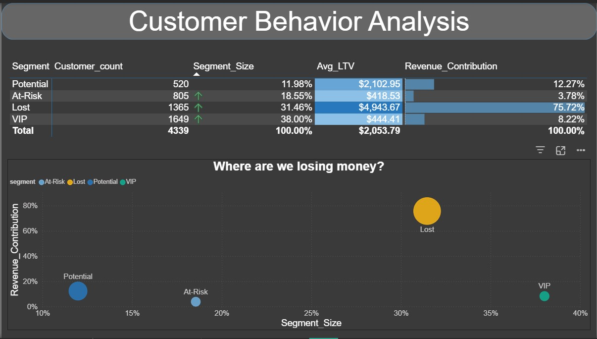
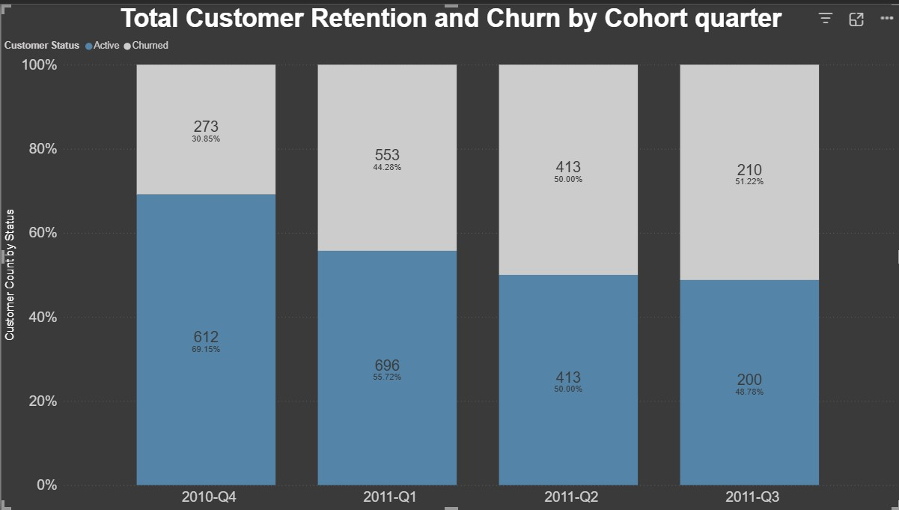

# Customer Behavior & Retention Analysis For Business Growth and Marketing Strategy

## Introduction
This project provides an end-to-end analysis of customer behavior and retention patterns, leveraging SQL for advanced data transformation and Power BI for strategic visualization. By segmenting customers based on their purchase activity and analyzing cohort trends, this dashboard transforms raw transactional data into actionable insights for driving business growth and marketing strategy.  

## Business Questions

1. **Segment Profitability & Risk Mitigation**: Where is the business currently losing the most value, and how should we reallocate our marketing budget between "Lost," "At-Risk," and "VIP" segments to maximize ROI?

2. **Business Health & Growth Trajectory**: How effectively is our current marketing strategy acquiring and retaining customers over time, and do these trends indicate a need to pivot our approach to improve long-term retention?  

## Data Cleanup & Preparation

To transform raw transactional data into actionable insights, I established a robust master view in SQL. This process involved several key cleaning and preparation steps to ensure data integrity.  

🖥️ View : [Customer_transaction_view](Scripts/customer_transaction_view.sql)

* **Data Cleaning:** I removed inconsistent records, handled missing values, and standardized formats across the datasets to ensure accurate aggregation.
* **Master View Creation:** I engineered a structured master view that aggregates customer activity, calculates LTV per segment, and tracks cohort retention metrics, providing a clean, single source of truth for my future queries.   

### 1. Customer Behavior & Segmentation

💻 **Query:** [1_customer_segmentation](Scripts/1_customer_segmentation.sql)

* Tracked customer segments based on their size and revenue contribution.
* Calculated Average Lifetime Value (LTV) across distinct behavior tiers.

📊 **Visualization:**

💡 **Key Findings:**
* **Revenue Concentration:** The "Lost" segment, despite being a churn risk, constitutes 75.72% of total revenue contribution.
* **High-Value Base:** The "Lost" segment holds the highest Average Lifetime Value (LTV) at $4,943.67, indicating that these were once highly engaged, high-spending customers.
* **Segment Balance:** While the "VIP" segment has the largest customer count (38.00%), its revenue contribution (8.22%) is significantly lower than the "Lost" segment.

💡 **Business Insights:**
* **Win-Back Strategy:** We must prioritize a dedicated "win-back" campaign for the "Lost" segment; regaining the trust of these high-value customers offers the greatest potential for immediate revenue recovery.
* **VIP Nurturing:** We need to shift focus toward delivering higher value to the "VIP" segment to increase their individual spending, as they currently represent a large portion of the customer base but a smaller portion of total revenue.
* **Resource Reallocation:** We should pivot marketing efforts away from broad acquisition and toward targeted retention, ensuring that the highest LTV segments receive the most strategic attention.
### 2. Customer Retention & Churn

💻 **Query:** [2_customer_retention](Scripts/2_customer_retention.sql)

* Evaluated quarterly active versus churned customer status.
* Calculated retention percentages to identify cohort-level loyalty trends.

📊 **Visualization:**

💡 **Key Findings:**
* **Downward Trend:** There is a clear and consistent decline in the percentage of active customers from 2010-Q4 (69.15%) through 2011-Q3 (48.78%).
* **Churn Acceleration:** Conversely, the churn percentage has gradually increased every quarter, rising from 30.85% in 2010-Q4 to over 50% by 2011-Q3.
* **Retention Crisis:** By 2011-Q3, the number of churned customers has overtaken the number of active customers, indicating that the business is losing long-term engagement.

💡 **Business Insights:**
* **Immediate Marketing Review:** We need to flag this downward trend to the marketing department immediately, as the current strategy is failing to maintain long-term customer stickiness.
* **Churn Investigation:** We must investigate the specific customer experience factors present in 2011-Q2 and 2011-Q3 to understand what changed that caused the active-to-churn ratio to flip negatively.
* **Pivot Strategy:** Since the retention trend is deteriorating, We should recommend a pivot away from the current acquisition-focused approach toward a retention-first model to stabilize the active customer base.  

## Strategic Recommendations

Based on the behavioral analysis and retention trends identified, I recommend the following strategic actions to stabilize growth and maximize profitability:

* **High-Value Win-Back Campaigns:** Since the "Lost" segment holds the highest Lifetime Value (LTV) at $4,943.67, We must prioritize targeted re-engagement campaigns. Recovering these customers is more cost-effective and revenue-impactful than acquiring new, unproven leads.
* **Retention-First Marketing Pivot:** Given the steady decline in active customers—dropping from 69.15% in 2010-Q4 to 48.78% by 2011-Q3— I recommend shifting the marketing budget away from broad acquisition and toward retention-focused initiatives to reverse this negative trend.
* **VIP Nurturing Programs:** We should implement loyalty-driven value propositions for the "VIP" segment. While they constitute our largest customer base (38%), their lower revenue contribution suggests a missed opportunity for upselling and increasing individual spending.
* **Operational Churn Analysis:** We must initiate a deep-dive investigation into the 2011-Q2/Q3 cohorts to identify specific friction points or changes in service quality that caused the surge in churn, ensuring we can pivot our strategy to prevent further attrition.  

## 🛠️ Technical Details

* **Database:** PostgreSQL
* **Analysis & Querying:** PostgreSQL, DBeaver
* **Data Visualization:** Power BI